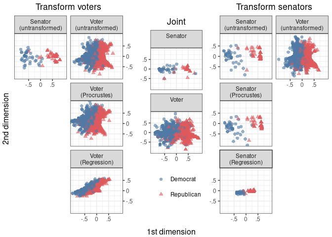
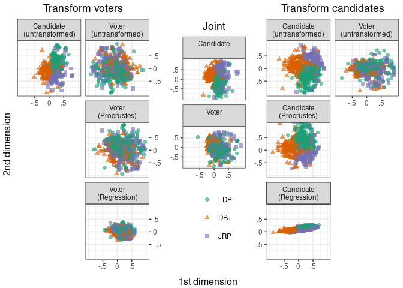
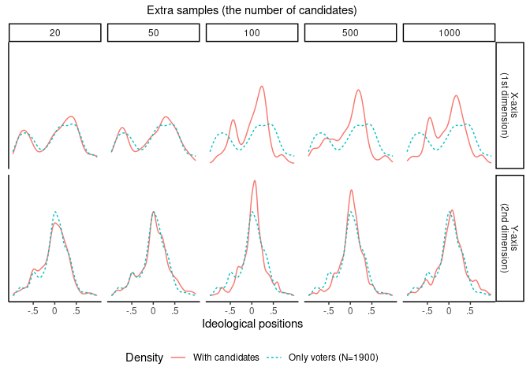
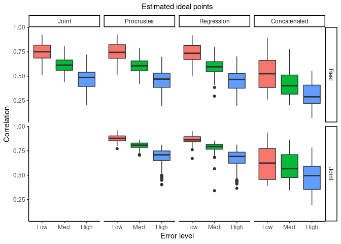
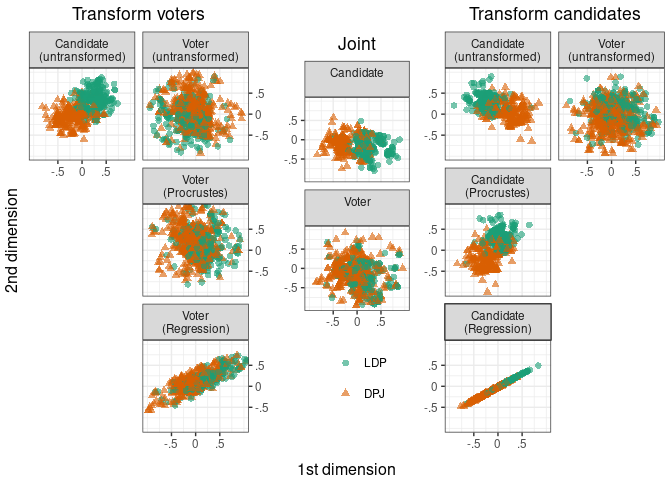

Towards a General Methodology of Bridging Ideological Spaces
================
Tzu-Ping Liu & Gento Kato
July 24, 2020

  - [Preparation](#preparation)
  - [Figure 1 (Illustration of Transformation
    Types)](#figure-1-illustration-of-transformation-types)
  - [Figure 2 (Apply Bridging to Senate
    Data)](#figure-2-apply-bridging-to-senate-data)
  - [Figure 3 (Apply Bridging to UTAS12
    Data)](#figure-3-apply-bridging-to-utas12-data)
  - [Figure 4 (Validating an Assumption through UTAS12
    Data)](#figure-4-validating-an-assumption-through-utas12-data)
  - [Figure 5 (Evaluating Performance through
    Simulation)](#figure-5-evaluating-performance-through-simulation)
  - [Figure A1 (Apply Bridging to UTAS09
    Data)](#figure-a1-apply-bridging-to-utas09-data)

# Preparation

``` r
## Clear Workspace
rm(list = ls())

## Set Working Directory (Automatically) ##
require(rprojroot); require(rstudioapi)
if (rstudioapi::isAvailable()==TRUE) {
  setwd(dirname(rstudioapi::getActiveDocumentContext()$path)); 
} 
projdir <- find_root(has_file("thisishome.txt"))
cat(paste("Working Directory Set to:\n",projdir))
```

    ## Working Directory Set to:
    ##  /home/gentok/GoogleDrive/Projects/OOC_Bridging/tp_github

``` r
setwd(projdir)
```

# Figure 1 (Illustration of Transformation Types)

``` r
## Clear Workspace
rm(list = ls())
projdir <- find_root(has_file("thisishome.txt"))

## Run Code
source(paste0(projdir, "/Codes/Figure_1.R"))
```

<!-- -->

# Figure 2 (Apply Bridging to Senate Data)

``` r
## Clear Workspace
rm(list = ls())
projdir <- find_root(has_file("thisishome.txt"))
```

``` r
## Rearrange Data
source(paste0(projdir, "/Codes/Figure_2/Figure_2_0_data_rearrange.R"))
```

``` r
## Bridge Ideal Points
source(paste0(projdir, "/Codes/Figure_2/Figure_2_1_ip_estimation.R"))
```

``` r
## Visualize Results
source(paste0(projdir, "/Codes/Figure_2/Figure_2_2_plot.R"))
```

<!-- -->

# Figure 3 (Apply Bridging to UTAS12 Data)

``` r
rm(list = ls())
projdir <- find_root(has_file("thisishome.txt"))
```

``` r
## Rearrange Data
source(paste0(projdir, "/Codes/Figure_3/Figure_3_0_data_rearrange1.R"))
```

``` r
## Rearrange Data Again
rm(list = ls())
projdir <- find_root(has_file("thisishome.txt"))
source(paste0(projdir, "/Codes/Figure_3/Figure_3_0_data_rearrange2.R"))
```

``` r
## Bridge Ideal Points
source(paste0(projdir, "/Codes/Figure_3/Figure_3_1_ip_estimation.R"))
```

``` r
## Visualize Results
source(paste0(projdir, "/Codes/Figure_3/Figure_3_2_plot.R"))
```

<!-- -->

# Figure 4 (Validating an Assumption through UTAS12 Data)

``` r
rm(list = ls())
projdir <- find_root(has_file("thisishome.txt"))
```

``` r
## Run Simulation *The version used for poster is missing
## Run Simulation *Not the version used for poster
# source(paste0(projdir, "/Codes/Figure_4/Figure_4_0b_data_creation.R"))
```

``` r
## Rearrange Results * The version used for poster
rm(list = ls())
projdir <- find_root(has_file("thisishome.txt"))
source(paste0(projdir, "/Codes/Figure_4/Figure_4_1a_data_rearrange2.R"))
## Rearrange Results * Not the version used for poster
# rm(list = ls())
# projdir <- find_root(has_file("thisishome.txt"))
# source(paste0(projdir, "/Codes/Figure_4/Figure_4_1b_data_rearrange2.R"))
```

``` r
## Export Plot
source(paste0(projdir, "/Codes/Figure_4/Figure_4_2_plot.R"))
```

<!-- -->

# Figure 5 (Evaluating Performance through Simulation)

``` r
rm(list = ls())
projdir <- find_root(has_file("thisishome.txt"))
```

``` r
## Implementing Simulation 
source(paste0(projdir, "/Codes/Figure_5/Figure_5_0_data_creation.R"))
rm(list = ls())
projdir <- find_root(has_file("thisishome.txt"))
```

``` r
## Estimate Ideal Points
source(paste0(projdir, "/Codes/Figure_5/Figure_5_1_plot.R"))
```

<!-- -->

# Figure A1 (Apply Bridging to UTAS09 Data)

``` r
rm(list = ls())
projdir <- find_root(has_file("thisishome.txt"))
```

``` r
## Rearrange Data
source(paste0(projdir, "/Codes/Figure_A1/Figure_A1_0_data_rearrange1.R"))
```

``` r
## Rearrange Data Again
rm(list = ls())
projdir <- find_root(has_file("thisishome.txt"))
source(paste0(projdir, "/Codes/Figure_A1/Figure_A1_0_data_rearrange2.R"))
```

``` r
## Estimate Ideal Points
source(paste0(projdir, "/Codes/Figure_A1/Figure_A1_1_ip_estimation.R"))
```

``` r
## Estimate Ideal Points
source(paste0(projdir, "/Codes/Figure_A1/Figure_A1_2_plot.R"))
```

<!-- -->
